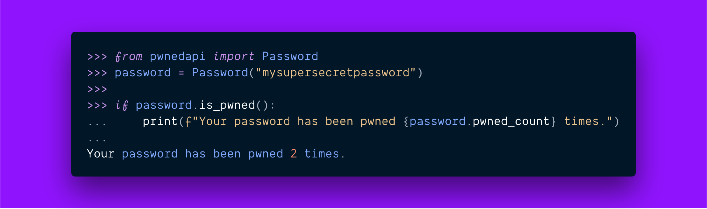
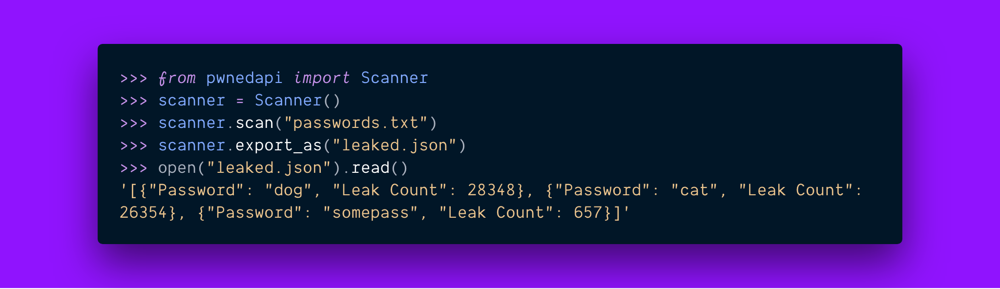

# `pwnedapi` (Have I Been Pwned)

[](https://app.codacy.com/project/nikoheikkila/pwnedapi/dashboard)
[](https://travis-ci.org/nikoheikkila/pwnedapi)
[](https://codecov.io/gh/nikoheikkila/pwnedapi)
[](https://pypi.org/project/pwnedapi/)
[](https://pypi.org/project/pwnedapi/)
[](https://pwnedapi.readthedocs.io/en/latest/)
[](LICENSE)
[](https://twitter.com/nikoheikkila)

A Python library to leverage **Troy Hunt's** [_Have I Been Pwned API v2_][hibp]
and the _k-Anonymity_ model. Inspired by **Phil Nash's** Ruby gem [_pwned_][pwned].

Supported on Python versions 3.5 and up.

## Installation

```bash
# Option 1: From the PyPI repository
pip install pwnedapi

# Option 2: For people of great taste
pipenv install pwnedapi

# Option 3: Locally
git clone https://github.com/nikoheikkila/pwnedapi
cd pwnedapi
python setup.py install
```

## Usage

In its simplest form you'll only need to use two methods.
Will probably add more if and when the API grows.



You can also scan a file of passwords, and export results in any format
supported by the [`tablib`][tablib] library.



## CLI usage

The library also installs a command-line tool which you can use to check
your password from the comfort of your terminal. Run `pwned` to see all the possibilities.

## Development

Clone the repository normally. Then run `make` to install the dependencies.

While developing it's useful to ensure an acceptable code quality where the
Pylama linter is helpful: run `make lint` to check your code. Once you have
written your tests run `make test` to invoke the PyTest suites.

To run tests and calculate the code coverage run `make coverage`. This command
will fail if you haven't set up a Codecov project with `$CODECOV_TOKEN`
variable.

Remember to document your features and see that the documentation compiles
successfully by running `make docs`.

## Contributing

Check the source code and issues from this repository, and should anything
interesting pop out feel free to open a pull request.

Before your changes will be merged make sure that Travis CI pipeline is green
and code coverage is on acceptable level. GitHub takes care of these
eventually but to save time always consider running the tests locally before
pushing.

[hibp]: https://haveibeenpwned.com/API/v2#SearchingPwnedPasswordsByRange
[pwned]: https://philnash.github.io/pwned/
[tablib]: http://docs.python-tablib.org/en/latest/
