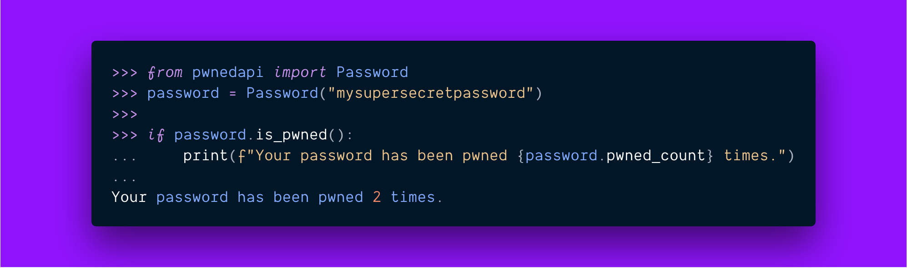

# Usage

The package can safely be imported with `import pwnedapi` to your Python
application as there is very little overhead.

## Password

### `pwnedapi.Password(password, request_headers={}, read_timeout=10)`

**Parameters:**

- `password` – String containing the password to be checked. _(Required)_
- `request_headers` – Custom HTTP headers to be sent to Have I Been Pwned API. Defaults to an empty dictionary.
- `read_timeout` – How many seconds to keep listening for the API response. Defaults to 10 seconds.

### `get_value() -> str`

Returns the password used.

### `hash_password() -> str`

Calculates a SHA-1 hash of the password and returns it in upper-case form.

### `is_pwned() -> bool`

Checks if the password has been _pwned_ (included in one or more data breaches).

## Utilities

### `utils.Scanner(extra_cols=[])`

**Parameters:**

- `extra_cols` – A list containing extra columns in addition to _Password_ and _Leak Count_. Defaults to an empty list.

### `get_headers() -> Any`

Returns the headers used for data representation.

### `export(format='csv') -> tablib.Dataset`

Exports the dataset to given format.

**Parameters:**

- `format` – data format supported by `tablib`. Defaults to CSV.

### `export_as(output_file)`

Exports and saves the dataset to given file path.

**Parameters:**

- `output_file` – File path as string for saving. _(Required)_.

### `scan(filename, sleep_time=0.2) -> self`

Scans the given password file.

**Parameters:**

- `filename` – File path to scan for. _(Required)_.
- `sleep_time` – How long in seconds to wait between each request as the file iteration proceeds. Defaults to 200 milliseconds.

